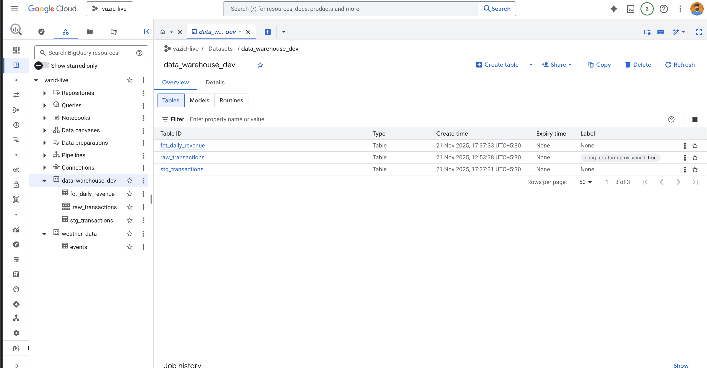
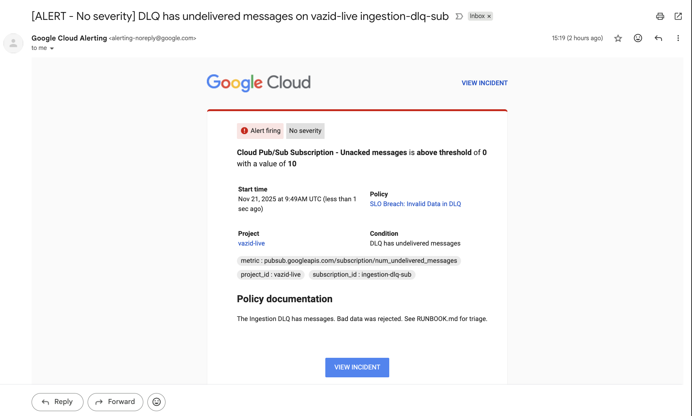

# GCP DataOps Pipeline (Case 2)

## Overview
This repository implements a "governed" data pipeline on Google Cloud Platform (GCP). It demonstrates a robust DataOps workflow including schema-on-write validation, idempotency, automated quality gates (dbt), and infrastructure-as-code (Terraform).


## Project Structure
```
├── dbt_project/        # Data transformation logic & tests
├── src/                # Python Cloud Function (Ingestion logic)
├── terraform/          # Infrastructure as Code (GCP resources)
├── .github/workflows/  # CI/CD Pipeline configuration
└── RUNBOOK.md          # Operational guide for SLO breaches
```

## Setup & Deployment
1. Prerequisites
    Google Cloud Project

    Terraform >= 1.0

    GitHub Repository with Secrets configured (GCP_SA_KEY, GCP_PROJECT_ID)

2. Infrastructure Deployment

    The entire GCP footprint is managed via Terraform.

    To deploy the GCP infrastructure use terraform

    ```
    cd terraform
    terraform init
    terraform apply
    ```
    Here is Biguqery Data with three tables

    

3. dbt Setup (Local)

    ```
    cd dbt_project
    pip install dbt-bigquery
    dbt debug
    dbt run
    ```
    This is for local testing but for CI/CD I have deploy automation for so if there is any invalid data that we can access on BigQuery and it trigger the alert on PubSub

## Debug

    I have file name [invalid.json](./documents/invalid.json) with invalid data

    ```
    {
      "transaction_id": "tx_999",
      "created_at": "2025-11-21T12:00:00Z",
      "customer_id": "user_Bad"
    }
    ```

    This data schema does not match with our table data schema so when ever we push the data into bucket and dbt will look into bucket and send the bigqury to particular tables

    [valid.json](./documents/valid.json)

    ```
    {"transaction_id": "tx_101", "created_at": "2025-11-21T10:00:00Z", "amount": 150.50, "customer_id": "user_A"}
    {"transaction_id": "tx_102", "created_at": "2025-11-21T10:05:00Z", "amount": 200.00, "customer_id": "user_B"}
    ```

    If a file contains invalid schema, it is routed to the Dead Letter Queue. Refer to RUNBOOK.md for triage steps.

## SLO's

When data is invalid it will also give the alert to mail

